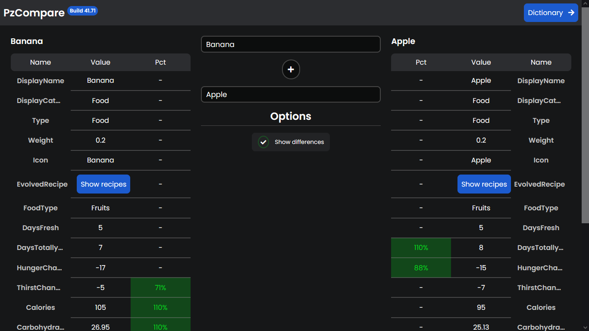
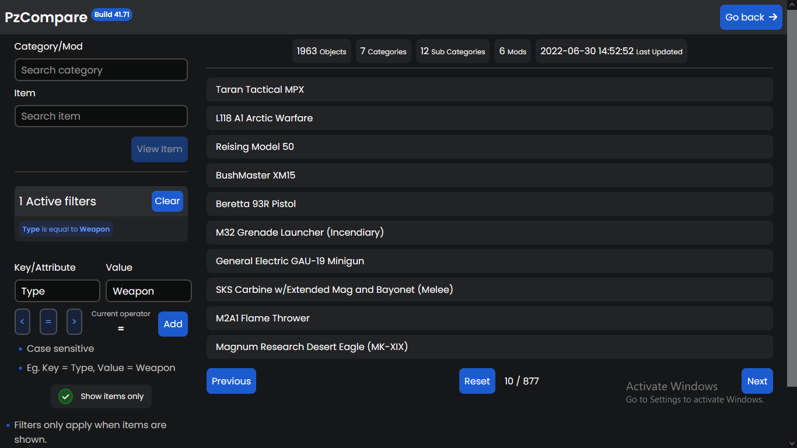

# PzCompare: Build
The predecessor of (PzCompare)[https://pz-compare.herokuapp.com] comes with many improvements like...
- Better visuals than AAA corporate sites.
- It's actually useful and works.
- Modular. (Customizing the style of the website, adding mods)

## Screenshots
Home
---

Dictionary
---

### Technologies used
- (React)[https://reactjs.org/]
- (TypeScript)[https://www.typescriptlang.org/]
- (Django)[https://www.djangoproject.com/]
- (CUBE-CSS)[https://cube.fyi/]
- (PostCSS)[https://postcss.org/]
- (Sass)[https://sass-lang.com/]
